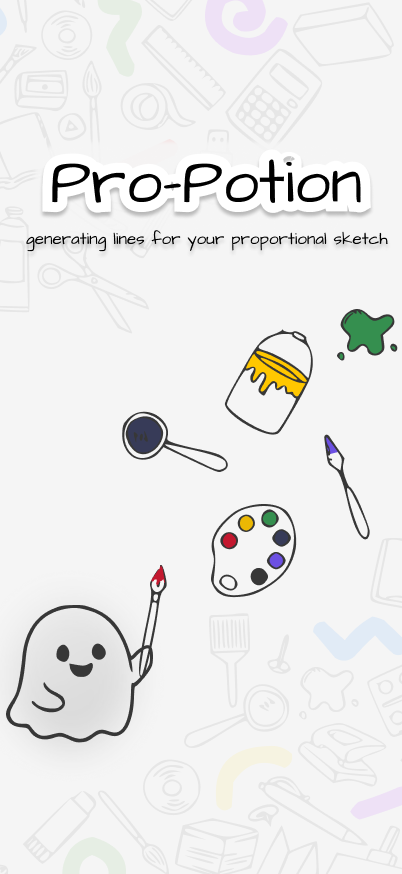
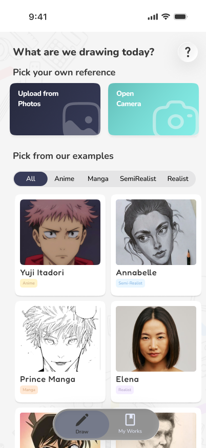
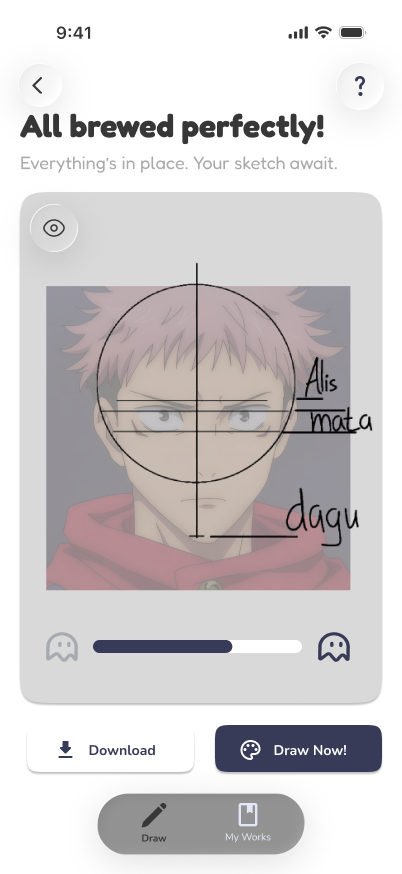
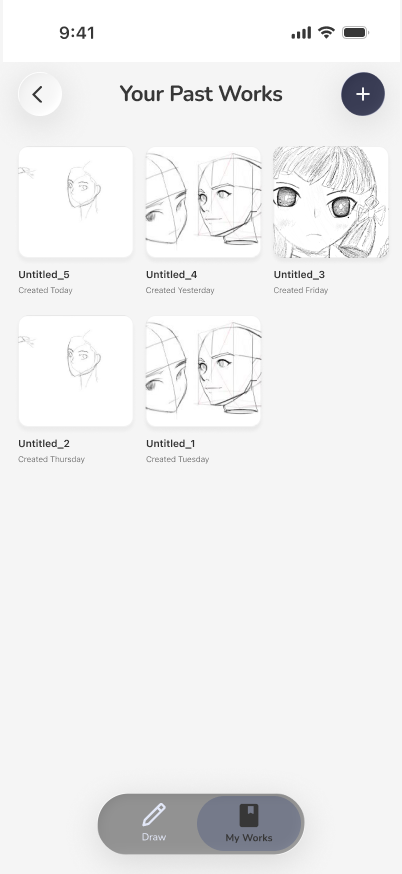

# Pro-Potion

**Helps beginner artists learn face proportions: pick a reference face, and the app draws the proportion guide lines on it so you can sketch along.**

An iOS app built by a team of 6 for the Apple Developer Academy (Challenge 2, April to May 2026).

  
  &nbsp;
  
  &nbsp;
  
  &nbsp;
  

## How it works

1. **Pick a reference:** upload a photo, take one with the camera, or choose a curated example by style (anime, manga, semi-realist, realist).
2. **Detect the face:** two Core ML models run through Vision, one to find faces and one to place facial landmarks.
3. **Draw the guides:** the landmarks become proportion guide lines (a head circle, a center line, and eyebrow and chin lines) over the reference.
4. **Sketch and save:** draw on a PencilKit canvas with the guides as a layer, then save the result to My Works.

## Architecture

- **Face detection:** [`FaceDetectorService`](aestheraApp/Services/FaceDetectorService.swift) runs a YOLO face detector and a landmark model through Vision. [`YoloDecoder`](aestheraApp/Helpers/YoloDecoder.swift) turns the raw model output into face boxes, and the [`ProportionLine`](aestheraApp/Models/ProportionLine) models turn landmarks into guide shapes that convert to PencilKit strokes.
- **Navigation:** an `@Observable` [`AppRouter`](aestheraApp/Models/AppRouter.swift) owns a single `NavigationStack` path. Screens call intent-named methods like `startScan(with:)`, `showResult(faces:)` and `showFail(message:)` instead of pushing views themselves.
- **Saving:** [`SavedScanStore`](aestheraApp/Services/SavedScanStore.swift) writes the image to disk and stores the face data in SwiftData as JSON; if a save fails partway, the image file is removed so nothing is left behind.
- **Drawing:** [`DrawingCanvasView`](aestheraApp/Views/DrawingCanvasView.swift) is a PencilKit canvas with the guide lines as a layer.
- **Camera:** [`CameraPicker`](aestheraApp/Views/CameraPicker.swift) wraps UIKit's `UIImagePickerController` for SwiftUI.

## Tech

SwiftUI · SwiftData · Core ML · Vision · PencilKit · UIKit (camera) · iOS 26.2 · Xcode 26

## Run it

The two Core ML models (`AnimeFaceYOLO.mlpackage` and `AnimeFaceLandmarks.mlpackage`) are **not in this repo**. One of them is 118 MB, over GitHub's 100 MB file limit. To build:

1. Clone the repo and open `aestheraApp.xcodeproj`.
2. Ask the team for the two model packages and place them in `aestheraApp/Models/CoreMLPackages/`.
3. Select your team under **Signing & Capabilities** and run.

## Team

| | Main areas |
|---|---|
| [@Ahingg](https://github.com/Ahingg) | Face detection pipeline, proportion geometry |
| [@jennyelena12](https://github.com/jennyelena12) | Drawing canvas |
| [@jesslyntrixie](https://github.com/jesslyntrixie) | Navigation, screens, saving, camera |
| [@johannaaw](https://github.com/johannaaw) | Tutorial assets |

## Next steps

- **Ship the models properly,** with Git LFS or a download on first launch, so the project builds from a fresh clone.
- **Unit tests** for navigation, saving and the YOLO decoder.
- **Replace the curated reference images** with ones the team has the rights to before any public release.
